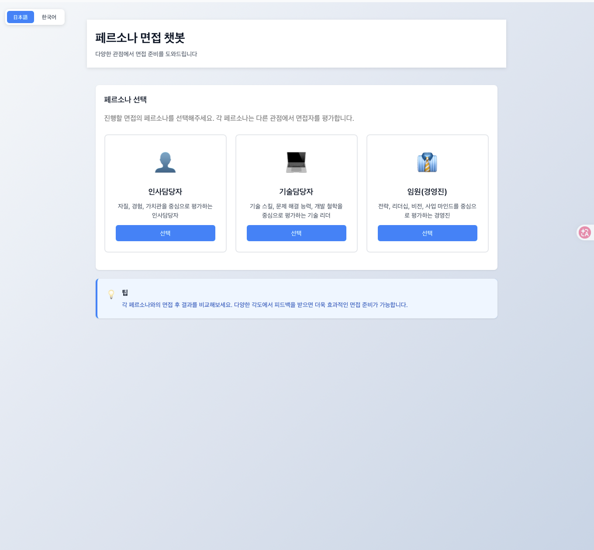
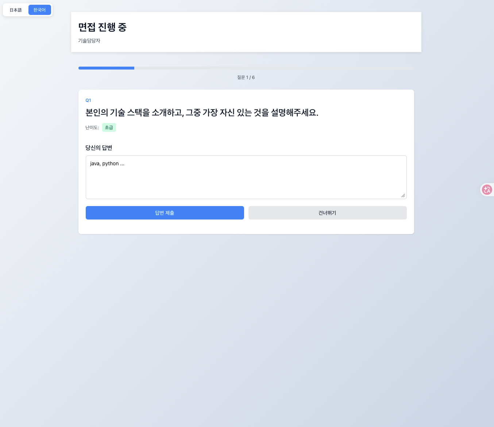
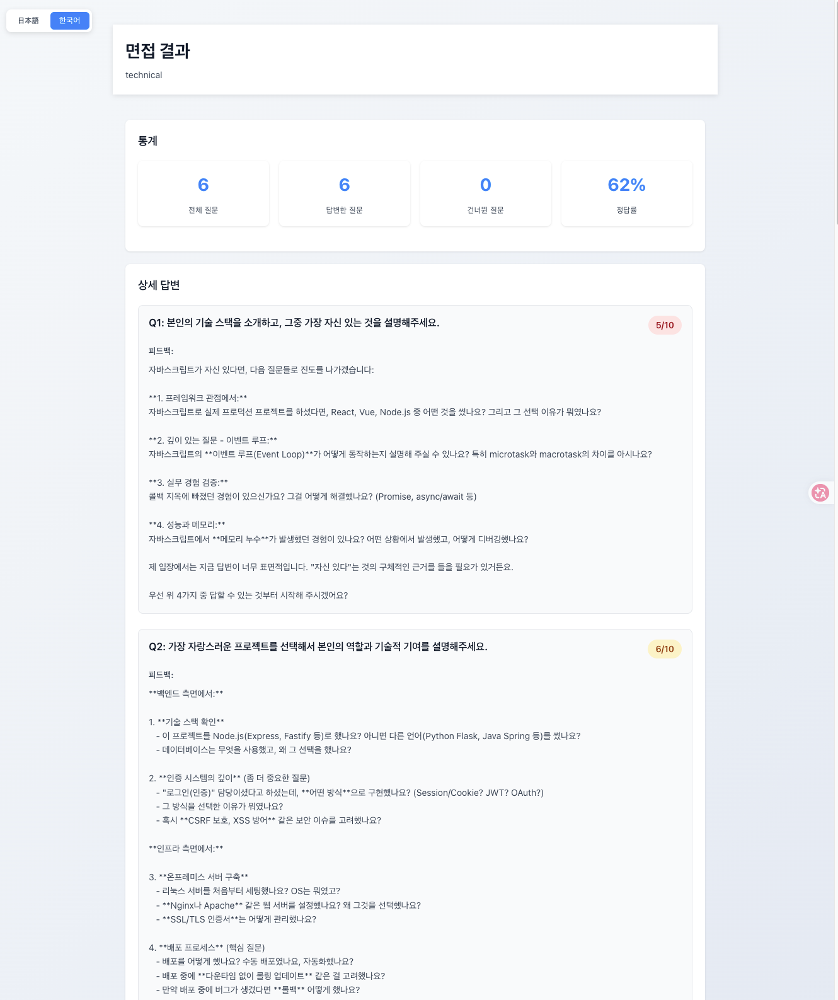
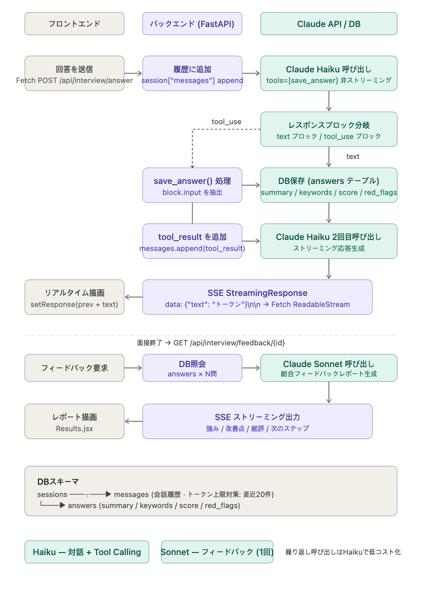

# Persona Interview Chatbot

> 🇰🇷 [한국어](#한국어) | 🇯🇵 [日本語](#日本語)

---

<a id="한국어"></a>

## 🇰🇷 한국어

### 개요

LLM의 System Prompt로 다양한 페르소나를 구현하고,  
페르소나별 맞춤 면접 질문에 AI가 실시간 평가를 제공하는 면접 연습 애플리케이션.

취업 준비 과정에서 피드백을 줄 수 있는 상대가 없다는 문제에서 출발.  
**인사담당자 / 기술담당자 / 임원** 3종 페르소나 기반 AI 면접관을 구현.

---

### 화면

| 페르소나 선택 | 면접 진행 |
|:---:|:---:|
|  |  |

| 면접 결과 |
|:---:|
|  |

---

### 기술 스택

| 계층 | 기술 |
|------|------|
| Backend | FastAPI, Uvicorn, Pydantic |
| Frontend | React 18, Vite |
| LLM | Anthropic Claude API (Haiku / Sonnet) |
| Streaming | SSE (Server-Sent Events) |
| DB | PostgreSQL (Docker) / SQLite (로컬) |
| ORM | SQLAlchemy 2.0 |
| Infra | Docker, Docker Compose |

---

### 아키텍처 & 주요 흐름



#### 1. 면접 대화 (Haiku + Tool Calling)

```
유저 답변 제출
    │
    ▼
Claude Haiku — 비스트리밍 (tools=[save_answer])
    ├─► tool_use → save_answer() 자동 호출
    │        └─► DB 저장: answer_summary / keywords / score / red_flags
    └─► tool_result 추가 후 Haiku 스트리밍
    │
    ▼
실시간 피드백 → 브라우저 (SSE)
```

#### 2. 최종 피드백 리포트 (Sonnet)

```
면접 종료 → DB 구조화 데이터 조회
    │
    ▼
Claude Sonnet — 종합 리포트 생성 (SSE 스트리밍)
강점 / 개선점 / 페르소나 시점 총평 / 다음 스텝
```

---

### 설계 포인트

**① System Prompt로 페르소나 설계**  
별도 파인튜닝 없이 Role / Tone / Scope / Rules 4요소로 3종 면접관 구현.  
페르소나별 독립 질문 + 평가 축(eval_criteria) 분리.

| 페르소나 | 평가 축 |
|----------|---------|
| 인사담당자 | 문화적합성 / 커뮤니케이션 / 성장의지 |
| 기술담당자 | 기술깊이 / 문제해결력 / 설계사고 |
| 임원 | 전략적사고 / 리더십 / 비전명확성 |

**② Tool Calling으로 구조화 추출**  
자유형 텍스트 응답에서 평가 데이터를 안정적으로 추출. 정규식 파싱보다 신뢰성 높음.

**③ 모델 역할 분리 (비용 최적화)**

| 역할 | 모델 | 이유 |
|------|------|------|
| 대화 + Tool Calling | `claude-haiku-4-5` | 빠름, 저렴, 반복 호출 |
| 최종 피드백 리포트 | `claude-sonnet-4-5` | 정확, 깊은 분석 (1회) |

**④ Fetch + ReadableStream (XHR 대신)**  
POST 요청 SSE를 현대 표준 방식으로 처리. buffer로 미완성 청크 안전 처리.

**⑤ DB 영속화**  
`DATABASE_URL` 환경변수 하나로 SQLite ↔ PostgreSQL 자동 전환. cascade 삭제 설정.

---

### 실행 방법

```bash
# DB (Docker)
docker compose up -d

# 백엔드
cd backend && pip install -r requirements.txt
uvicorn main:app --reload --port 8000

# 프론트엔드
cd frontend && npm install && npm run dev
```

- Frontend: `http://localhost:5173`
- Backend:  `http://localhost:8000`
- pgAdmin:  `http://localhost:5050`

---

### 개발 기간 · 인원

2026.04 ~ 현재 / 1명

---
---

<a id="日本語"></a>

## 🇯🇵 日本語

### 概要

LLMのSystem Promptで多様なペルソナを実装し、  
ペルソナ別の面接質問にAIがリアルタイム評価を提供する面接練習アプリケーション。

就職活動中にフィードバックをくれる相手がいないという問題から出発。  
**人事担当者 / 技術担当者 / 役員** 3種ペルソナ型AIメンターを実装。

---

### 画面

| ペルソナ選択 | 面接進行 |
|:---:|:---:|
|  |  |

| 面接結果 |
|:---:|
|  |

---

### 技術スタック

| レイヤー | 技術 |
|----------|------|
| Backend | FastAPI, Uvicorn, Pydantic |
| Frontend | React 18, Vite |
| LLM | Anthropic Claude API (Haiku / Sonnet) |
| Streaming | SSE (Server-Sent Events) |
| DB | PostgreSQL (Docker) / SQLite (ローカル) |
| ORM | SQLAlchemy 2.0 |
| Infra | Docker, Docker Compose |

---

### アーキテクチャ & 主要フロー


#### 1. 面接対話フロー (Haiku + Tool Calling)

```
ユーザー回答送信
    │
    ▼
Claude Haiku — 非ストリーミング呼び出し (tools=[save_answer])
    ├─► tool_use → save_answer() 自動呼び出し
    │        └─► DB保存: answer_summary / keywords / score / red_flags
    └─► tool_result追加後 Haiku ストリーミング
    │
    ▼
リアルタイムフィードバック → ブラウザ (SSE)
```

#### 2. 最終フィードバックレポート (Sonnet)

```
面接終了 → DB構造化データ取得
    │
    ▼
Claude Sonnet — 総合レポート生成 (SSEストリーミング)
強み / 改善点 / ペルソナ視点の総評 / 次のステップ
```

---

### 設計ポイント

**① System Promptによるペルソナ設計**  
ファインチューニングなしに Role / Tone / Scope / Rules の4要素で3種の面接官を実装。  
ペルソナ別に独立した質問セットと評価軸(eval_criteria)を分離。

| ペルソナ | 評価軸 |
|----------|--------|
| 人事担当者 | 文化的適合性 / コミュニケーション / 成長意欲 |
| 技術担当者 | 技術の深さ / 問題解決力 / 設計思考 |
| 役員 | 戦略的思考 / リーダーシップ / ビジョンの明確さ |

**② Tool Callingによる構造化データ抽出**  
自由形式のテキスト応答から評価データを安定的に抽出。正規表現パースより信頼性が高い。

```python
# save_answer ツール — 毎回の回答後に自動呼び出し
{
  "answer_summary": "回答の1〜2文要約",
  "keywords":       ["重要キーワード"],
  "score":          8,
  "red_flags":      ["懸念点"]
}
```

**③ モデル役割分離（コスト最適化）**

| 役割 | モデル | 理由 |
|------|--------|------|
| 対話 + Tool Calling | `claude-haiku-4-5` | 高速・低コスト・繰り返し呼び出し |
| 最終フィードバックレポート | `claude-sonnet-4-5` | 正確・深い分析（1回のみ） |

> Tool CallingによるStateful設計  
> 各回答をsave_answer()で構造化保存し、LLMの状態依存を排除。  
> 対話はHaiku、最終フィードバックはSonnetと役割別にモデルを使い分け、  
> コストと精度のバランスを最適化。

**④ Fetch + ReadableStream（XHRの代替）**  
POST リクエストのSSEを現代標準方式で処理。bufferで未完成チャンクを安全に管理。

```javascript
const res = await fetch('/api/interview/answer', { method: 'POST', body: ... })
const reader = res.body.getReader()
let buffer = ''
while (true) {
  const { done, value } = await reader.read()
  if (done) break
  buffer += decoder.decode(value, { stream: true })
  const events = buffer.split('\n\n')
  buffer = events.pop()  // 未完成チャンクを保持
  for (const event of events) { /* パース */ }
}
```

**⑤ DB永続化**  
`DATABASE_URL`環境変数一つでSQLite ↔ PostgreSQL自動切り替え。cascade削除設定済み。

---

### 実行方法

```bash
# DB (Docker)
docker compose up -d

# バックエンド
cd backend && pip install -r requirements.txt
uvicorn main:app --reload --port 8000

# フロントエンド
cd frontend && npm install && npm run dev
```

- Frontend: `http://localhost:5173`
- Backend:  `http://localhost:8000`
- pgAdmin:  `http://localhost:5050`

---

### 開発期間・人数

2026.04 〜 現在 / 1名
